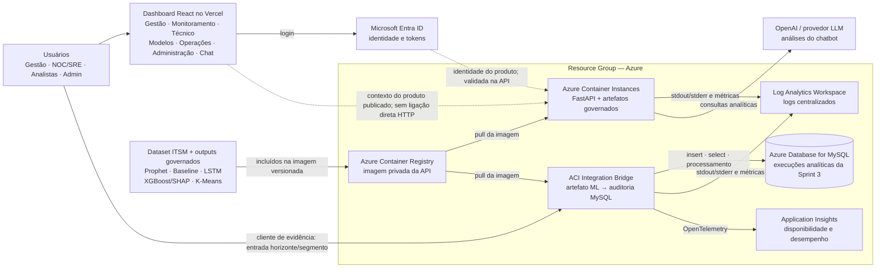

# Arquitetura Cloud da Sprint 3

## Visão da solução atual e evolução Azure

## Fluxo de ponta a ponta

1. O usuário acessa uma das telas atuais do dashboard ou abre o chatbot.
2. O frontend autentica o usuário pelo Microsoft Entra ID.
3. Na demonstração Cloud, um cliente de evidência envia horizonte e segmento ao bridge ACI por HTTP e chave efêmera.
4. O bridge lê o snapshot ML governado empacotado, calcula o resultado solicitado e registra a execução no MySQL.
5. A consulta e a agregação retornam o resultado persistido ao cliente de evidência.
6. Em paralelo, a API FastAPI atual é executada em outro ACI e seu health check comprova os artefatos disponíveis.
7. Stdout/stderr e métricas dos ACIs são enviados ao Azure Monitor/Log Analytics; o bridge instrumentado envia requisições ao Application Insights.
8. O frontend HTTPS publicado permanece no Vercel e não é apontado ao endpoint HTTP do ACI nesta demonstração.

## Por que ACR + ACI

- É uma das opções explicitamente permitidas no enunciado.
- Reaproveita o Dockerfile atual da API sem administrar sistema operacional de VM.
- O ACR mantém versões privadas e rastreáveis da imagem.
- O ACI permite publicar rapidamente a demonstração e cobrar apenas durante sua execução.
- Para produção de maior escala, Container Apps ou AKS seriam evoluções naturais; não são necessários para esta entrega.

## Banco de dados

O produto atual usa SQLite local ou PostgreSQL para chat e administração. A disciplina, entretanto, exige Azure Database for MySQL. Para não declarar uma compatibilidade inexistente, a Sprint 3 adiciona um bridge FastAPI isolado que lê os artefatos governados, registra execuções analíticas no MySQL e demonstra inserção, consulta e processamento. A migração completa do repositório transacional do produto não faz parte desta etapa.

Campos persistidos: identificador de correlação, tipo de modelo, horizonte, segmento, valor previsto, origem e SHA-256 do artefato e data/hora UTC. Não são persistidos prompts, tokens de autenticação ou chaves.

## Segurança

- Segredos não entram no código, imagem ou relatório.
- Senha MySQL e segredo da sessão são fornecidos na execução.
- A API mantém autenticação Entra e autorização por papel.
- O ACR é privado; credenciais devem ser tratadas como segredo de implantação.
- Acesso público ao MySQL deve ser temporário durante a demonstração; a arquitetura alvo usa rede privada.
- Logs devem evitar prompts, tokens e dados pessoais.

## Limitações declaradas

- ACI é adequado ao MVP acadêmico, mas não oferece toda a elasticidade de uma plataforma orquestrada.
- O frontend continua no Vercel para preservar o produto online; o componente Azure demonstrado é a API e sua integração de dados.
- O ACI público desta demonstração usa HTTP; integração direta com o frontend HTTPS exige uma camada TLS, fora do escopo acadêmico.
- A API atual e o bridge são demonstrações paralelas da mesma solução: não existe chamada API → bridge nesta Sprint.
