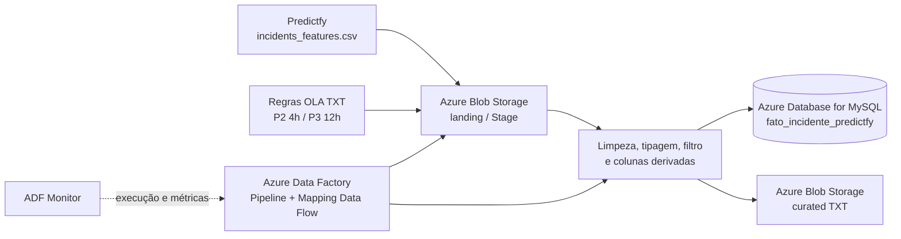

# Arquitetura do processo de ingestão

## Significado

O CSV processado do Predictfy representa atributos temporais, operacionais e históricos usados pelos modelos de previsão e risco. A pequena tabela TXT traduz o código de prioridade em P2/P3 e acrescenta o limite de OLA. Ambos chegam à zona `landing`, equivalente à Stage Area ensinada pelo professor. O Mapping Data Flow filtra, tipa, faz o join e deriva atributos antes de alimentar dois destinos: uma tabela analítica no MySQL e um TXT na zona `curated`.

O MySQL facilita consultas, auditoria e consumo por ferramentas de BI. O TXT mantém uma saída interoperável para integração com outros sistemas. O ADF Monitor fornece as evidências de execução, linhas lidas/escritas e falhas.

## Decisões

- **Azure Database for MySQL:** reaproveita o SGBD PaaS e o Resource Group do `01_cloud`, reduz custo e demonstra integração entre disciplinas. A documentação oficial do ADF confirma suporte como source/sink de Mapping Data Flow.
- **ADF e Storage separados:** são acréscimos exclusivos desta disciplina; nenhum artefato do `01_cloud` é alterado.
- **Carga inicial full e evolução incremental:** a Sprint executa a primeira carga completa; a chave SHA-256 e o upsert preparam reprocessamentos idempotentes, em linha com o conteúdo de hash/carga incremental do professor.
- **Uma transformação, dois sinks:** evita divergência entre a visão SQL e o arquivo TXT.
- **Dados sem identificadores pessoais:** a amostra usa features já codificadas do produto.
- **Segredos fora do Git:** a connection string entra como parâmetro `SecureString` do pipeline e nunca é versionada.
- **Idempotência:** `incident_feature_id` é uma chave técnica determinística para a versão imutável da amostra, e o destino MySQL usa `Alter Row` + upsert. Ela não deve ser interpretada como o número original do incidente.
